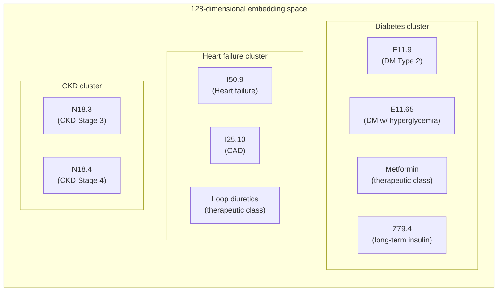
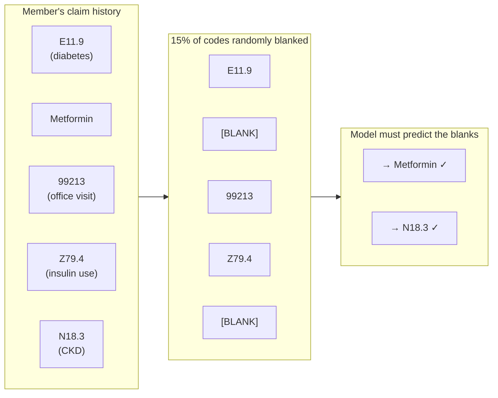
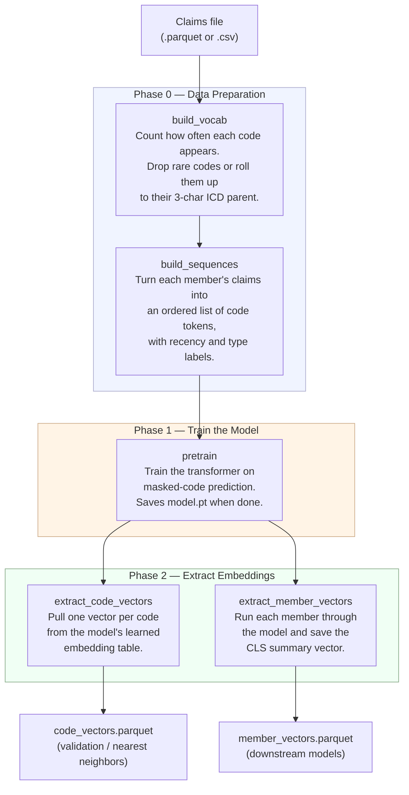

# ICD-10 Embeddings: Documentation

## Table of Contents

1. [What Is a Medical Code Embedding?](#1-what-is-a-medical-code-embedding)
2. [Why Embeddings Instead of Code Flags?](#2-why-embeddings-instead-of-code-flags)
3. [How the Model Learns](#3-how-the-model-learns)
4. [What You Get Out of It](#4-what-you-get-out-of-it)
5. [Running the Pipeline](#5-running-the-pipeline)
6. [Configuration Reference](#6-configuration-reference)
7. [Common Issues](#7-common-issues)

---

## 1. What Is a Medical Code Embedding?

### The problem with raw codes

A typical claims extract for one year might contain thousands of distinct ICD-10 diagnosis codes, hundreds of CPT procedure codes, and hundreds of drug therapeutic classes. The naive way to use this information in a model is to create one binary column per code: "did this member have E11.9? yes/no. Did they have 99213? yes/no." And so on.

That works, but it has a serious limitation: the model has no way of knowing that `E11.9` (Type 2 diabetes, uncontrolled), metformin (a diabetes drug), and `Z79.4` (long-term insulin use) are all related. To the model, they are three independent yes/no switches. If a member has all three, it has to learn that relationship three separate times from scratch, rather than recognizing them as a cluster.

### The embedding solution

An **embedding** is a compact numerical summary of a code's clinical meaning — specifically, a list of about 128 numbers. Instead of saying "E11.9 = 1" and "metformin = 1" in your feature table, you represent each code as a point in a 128-dimensional space. Codes that tend to appear together in claims histories end up positioned close together in that space.

**Analogy for actuaries:** An HCC-RAF score collapses a complex claims history into a single risk number, using a mapping hand-coded by CMS actuaries. An embedding is similar in spirit but different in two ways: it produces ~128 numbers instead of one, and those numbers are *learned from your own claims data* rather than assigned by a regulatory body. The model figures out the clinical structure on its own.

The diagram below illustrates the idea. After training, codes cluster by clinical similarity:



Two codes that are "close" in this space have similar clinical contexts — they tend to co-occur in the same members' histories. Two codes that are "far apart" rarely appear together.

---

## 2. Why Embeddings Instead of Code Flags?

| Approach | Feature columns | Captures co-occurrence? | Handles new codes? |
|---|---|---|---|
| Binary flags (one per code) | Thousands | No — each code is independent | Add a column manually |
| HCC flags (CMS mapping) | ~80 | Partially — within an HCC | CMS update required |
| **Embeddings (this project)** | **128** | **Yes — learned from data** | **Rare codes rolled up automatically** |

The 128-column member vector that this pipeline produces is a dense summary of a member's entire claims history. You feed that vector into whatever downstream model you're building — an HCC suspecting classifier, a premium model, a fraud scorer. The embeddings do the heavy lifting of translating thousands of messy codes into a compact, meaningful feature set.

**Important:** The embeddings themselves are *features*, not a model. They do not predict cost, HCC presence, or anything else on their own. Think of them as a richer, data-driven replacement for the code flag columns you would otherwise engineer by hand.

---

## 3. How the Model Learns

### The training task: fill in the blank

The model is trained using a technique called **masked code prediction** — essentially a fill-in-the-blank exercise on claims data. Here is what that looks like for a single member:



The model sees the rest of the sequence and must guess what was blanked out. To do this well it has to learn that "a member with E11.9, Z79.4, and an office visit probably also has metformin" — i.e., it learns clinical co-occurrence patterns.

This training requires no labels. The claims history itself is the training data. The model is entirely self-supervised.

### What the model sees

Each member's sequence contains all three code types together: diagnoses, procedures, and pharmacy (therapeutic classes). This is intentional. A metformin prescription is strong evidence for a diabetes diagnosis, and the model learns that cross-type signal naturally.

Demographic information — age and sex — is also fed into the model as context, but it is not predicted or masked. It just helps the model understand that the same code means something different in a 30-year-old versus a 70-year-old.

### Training output: one vector per member

After training, the model is asked to encode each member's full history (no blanks this time) into a single 128-number summary. This is the **member vector** — the main deliverable of the pipeline.

---

## 4. What You Get Out of It

The pipeline writes everything to your `output_dir`. The two files you will actually use downstream are:

### member_vectors.parquet — the main deliverable

One row per member. Columns: `member_id`, `client_id`, `age_id`, `sex_id`, `vector` (a list of 128 floats).

The `vector` column is what you feed into your downstream models. Each row is a member's complete clinical profile, compressed into 128 numbers.

### code_vectors.parquet — useful for validation

One row per code in the vocabulary. Columns: `token`, `token_id`, `code_type`, `member_count`, `vector`.

This is most useful for a sanity check: after training, run a nearest-neighbor query on a diabetes code and confirm that the closest codes are other diabetes-related codes (not fractures or ear infections). If the clusters make clinical sense, the model learned something real.

### Full pipeline overview



### Other files written to output_dir

| File | What it is |
|---|---|
| `vocab.parquet` | The token vocabulary: every code that made the frequency floor, plus 4 special tokens |
| `member_sequences.parquet` | Intermediate: each member's token list before the model sees it |
| `model.pt` | The trained model weights (needed to re-extract embeddings or continue training) |

---

## 5. Running the Pipeline

### Prerequisites

1. **Python environment** with dependencies installed:
   ```
   pip install -r requirements.txt
   ```
   The default `requirements.txt` installs a CPU build of PyTorch. If you have a GPU, install the CUDA build of torch separately and set `device="cuda"` — training is significantly faster on GPU.

2. **Claims file** in long format: one row per claim line, as a `.parquet` or `.csv` file. Required columns are listed in the [Configuration Reference](#6-configuration-reference) below.

3. **Pharmacy codes must be rolled up** to a therapeutic class (GPI or ATC level) before loading. The model is not designed for raw NDC codes. Diagnoses and procedure codes are fed as-is.

---

### Step 1: Edit run_embeddings.py

Open `run_embeddings.py`. The only section you need to edit is the `Config(...)` block at the top:

```python
config = Config(
    claims_path = "data/embedding_data.csv",   # path to your claims file
    output_dir  = "output/ACA",                # where outputs will be written
    line_of_business = "ACA",                  # must match exactly what's in your data
    observation_start = date(2015, 1, 1),      # first incurred date to include
    observation_end   = date(2017, 12, 31),    # last incurred date to include
    device = "cuda",                           # "cuda" for GPU, "cpu" otherwise
)
```

**`claims_path`** — Path to your claims extract. Can be absolute (`C:/data/claims.parquet`) or relative to the project folder. Parquet is preferred for speed; CSV also works.

**`output_dir`** — Folder where all output files will be written. It is created automatically if it does not exist. Use a separate folder per line of business so runs do not overwrite each other.

**`line_of_business`** — The filter value. Must match the exact string (including capitalization) that appears in the `line_of_business` column of your claims file. If you get an error saying no claims remain, this is usually the cause.

**`observation_start` / `observation_end`** — The date window for training data. Use **incurred dates** (date of service), not paid or processed dates. See the [IBNR note](#ibnr--claim-run-out) before setting `observation_end`.

**`device`** — Use `"cuda"` if a GPU is available, otherwise `"cpu"`. CPU training works but is much slower for large datasets.

#### If your column names differ from the defaults

The pipeline expects columns named `member_id`, `client_id`, `line_of_business`, `incurred_date`, `code`, `code_type`, `member_birth_date`, and `member_sex`. If your extract uses different names, add a `columns` argument to the Config:

```python
from icd_embeddings.config import ColumnMap

config = Config(
    ...
    columns = ColumnMap(
        member_id        = "mbr_id",
        client_id        = "employer_group",
        line_of_business = "lob",
        incurred_date    = "dos",
        code             = "diag_code",
        code_type        = "code_type",
        member_birth_date = "dob",
        member_sex       = "gender",
    ),
)
```

Only override the fields whose names differ — the rest stay at their defaults.

---

### Step 2: Run from the terminal

Navigate to the project folder and run:

```
python run_embeddings.py
```

The pipeline will print progress as it goes. A typical run looks like this:

```
[build_vocab] 4,312 dx tokens, 891 proc tokens, 203 rx tokens (+ 4 special)
[build_sequences] built sequences for 48,201 members
[pretrain] epoch   1 | train loss 6.2143 | val loss 6.1820 | val top1 0.021 | val top5 0.089
[pretrain] epoch   2 | train loss 5.8901 | val loss 5.7644 | val top1 0.038 | val top5 0.142
          -> new best val loss 5.7644, checkpoint saved
...
[pretrain] early stopping: val loss did not improve for 5 consecutive epochs
[extract] saved code_vectors.parquet (5,410 codes)
[extract] saved member_vectors.parquet (48,201 members)
```

**What the training metrics mean:**

- **train loss / val loss** — how wrong the model's guesses are on training vs. held-out members. Lower is better. You want both to decrease over time.
- **val top1** — fraction of masked codes where the model's single best guess was exactly right. 0.1 means it got 10% correct on the first try, which is strong given thousands of possible codes.
- **val top5** — fraction of masked codes where the correct answer was in the top 5 guesses. This is usually 2–3× higher than top1.

**Early stopping** means training halted automatically because validation loss stopped improving. This is expected and desirable — it saves the best model rather than the last one.

---

### Step 3: Use the outputs

After the run completes, your `output_dir` will contain:

```
output/ACA/
├── vocab.parquet
├── member_sequences.parquet
├── model.pt
├── code_vectors.parquet
└── member_vectors.parquet
```

Load `member_vectors.parquet` in pandas to get your feature table:

```python
import pandas as pd
import numpy as np

member_vectors = pd.read_parquet("output/ACA/member_vectors.parquet")

# The vector column holds Python lists. Convert to a 2D numpy array for modeling.
feature_matrix = np.asarray(member_vectors["vector"].tolist())
# Shape: (n_members, 128)
```

Join on `member_id` to merge with your labels or other member data before modeling.

To run a sanity check on the code embeddings:

```python
from icd_embeddings.embeddings.extract import nearest_neighbors

code_vectors = pd.read_parquet("output/ACA/code_vectors.parquet")
neighbors = nearest_neighbors(code_vectors, query_token="E11.9", query_code_type="dx", k=10)
print(neighbors)
```

If the top neighbors are other diabetes codes, metformin, and insulin-related codes, the model has learned clinically meaningful structure.

---

### Running a second line of business

Just change `line_of_business` and `output_dir` in the Config and run again. Each LOB gets its own vocabulary, sequences, model, and embeddings — they do not share anything.

```python
config = Config(
    claims_path = "data/embedding_data.csv",   # same file, different LOB filtered out
    output_dir  = "output/MA",
    line_of_business = "MA",
    observation_start = date(2015, 1, 1),
    observation_end   = date(2017, 12, 31),
    device = "cuda",
)
```

---

## 6. Configuration Reference

### Required — must be set

| Parameter | Type | Description |
|---|---|---|
| `claims_path` | path | Location of the claims file (.parquet or .csv) |
| `output_dir` | path | Where to write all output files (created if it does not exist) |
| `line_of_business` | string | LOB value to filter on; must match the data exactly |
| `observation_start` | date | First incurred date to include (inclusive) |
| `observation_end` | date | Last incurred date to include (inclusive) |

### Optional — sensible defaults, change when needed

| Parameter | Default | When to change |
|---|---|---|
| `device` | `"cpu"` | Set to `"cuda"` when a GPU is available |
| `min_count_dx` | 50 | Lower (e.g., 10–20) if your dataset has fewer than ~50k members |
| `min_count_proc` | 50 | Same guidance as above |
| `min_count_rx` | 50 | Same guidance as above |
| `rollup_rare_dx_to_3char` | `True` | Rarely need to change; rolls rare ICD codes to their 3-char parent |
| `max_sequence_length` | 256 | Increase if members have very long histories and you want full coverage |
| `embedding_dim` | 128 | Larger (256) if data is large and rich; smaller (64) for small datasets |
| `n_epochs` | 10 | Increase if early stopping fires in the first few epochs |
| `batch_size` | 256 | Reduce if you get out-of-memory errors on GPU |
| `validation_fraction` | 0.1 | 10% of members held out to measure progress; set to 0 to disable |
| `early_stopping_patience` | 5 | Epochs without improvement before stopping; increase to train longer |
| `warm_start` | `False` | Set to `True` to continue training from a previous checkpoint |
| `random_seed` | 12345 | Change for a different train/val split |

---

## 7. Common Issues

### IBNR / claim run-out

The most recent months in your claims data are almost certainly incomplete — claims take time to be submitted and processed. If you set `observation_end` too close to the current date, the model will undercount recent conditions, which biases the member vectors.

**Rule of thumb:** set `observation_end` at least 3–6 months before the date you are pulling the data. For example, if you are pulling in July 2024, consider `observation_end = date(2024, 1, 31)`.

---

### "Claims data is missing expected column(s)"

Your claims file has different column names than the defaults. Edit the `ColumnMap` in the Config as shown in [Step 1](#step-1-edit-run_embeddingspy) above.

---

### "No claims remain after filtering to line_of_business"

The `line_of_business` value in your Config does not match what is in the data. Check for differences in capitalization, spacing, or abbreviation. For example, `"ACA"` and `"aca"` will not match.

To check what values are in your data:
```python
import pandas as pd
df = pd.read_parquet("data/embedding_data.csv")
print(df["line_of_business"].value_counts())
```

---

### Pharmacy NDC codes in the data

If your `code` column contains raw NDC codes for pharmacy claims, the vocabulary will become enormous and the embeddings will be poor. NDC codes are too granular — there are hundreds of thousands of them and each drug appears under many codes. Roll pharmacy up to a therapeutic class level (GPI 2-digit or ATC level 3) before running.

---

### "CUDA is not available" / GPU errors

If you set `device="cuda"` but no GPU is available, PyTorch will throw an error immediately. Either switch to `device="cpu"` or verify your CUDA installation with:
```
python -c "import torch; print(torch.cuda.is_available())"
```

If you get an out-of-memory error during training, reduce `batch_size` in the Config (try halving it).

---

### Resuming a run that was interrupted

If training was interrupted before completing, set `warm_start=True` in your Config before re-running. The pipeline will load the last saved checkpoint and continue from where it left off. If no checkpoint exists yet (interrupted during Phase 0), just re-run normally — Phases 0 and 1 will both run from scratch.
